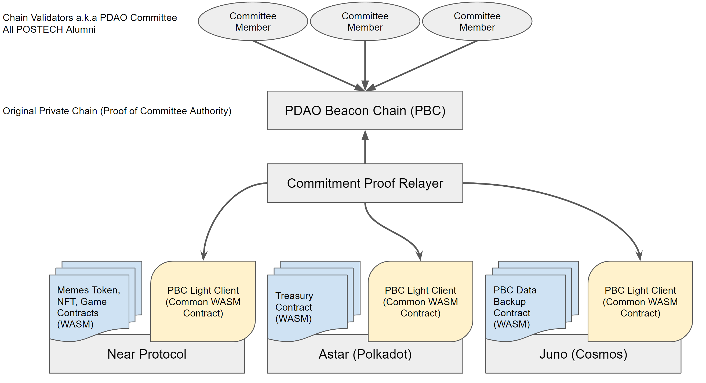

# PDAO: The Multichain DAO

이 글은 PDAO가 멀티체인 DAO로써 어떤 구조를 갖고 있으며,
여러 체인이 어떻게 소통하며 각각 무슨 역할을 하는지 소개합니다.
또한 이를 실행하는 프로토콜의 기술적인 개요를 간략하게 제시함으로써
궁극적으로 DAO로써 조직을 어떻게 검증가능하게 운영하는지 설명합니다.

- 작성자: 양준하
- 작성일: 2022년 6월 27일
- 도움을 준 사람: 강병지, 성해빈, 윤병준

## TL;DR
PDAO는 멀티체인 패러다임을 가집니다.
1. Rust로 자체 개발하는 PDAO Beacon Chain에서 의결권을 가진 구성원들이 합의한 내용을
2. Near, Polkadot, Cosmos등 WASM 컨트랙트를 기반으로 한 다양한 체인에 개발, 업로드 해놓은 애플리케이션 컨트랙트들에게
3. 라이트 클라이언트를 사용한 암호학적으로 안전한 방법으로 검증가능한 메세지로써 전달하여 컨트롤하고
4. 각 체인의 생태계에 특성에 맞게 재단, NFT, 밈토큰, 게임 등 다양한 Dapp을 꾸려나가며 다양한 체인들의 기술과 생태계를 탐험할 것입니다.

## 개요

PDAO는 포항공과대학교 동문들이 블록체인 기술을 선도하고 크립토 산업에서 활약하는 것을 지원하기 위해
설립된 공개 커뮤니티이자 이에 필요한 기부금을 운용하는 비영리 재단입니다([공식 소개글](https://github.com/postech-dao/pdao/blob/main/README.md)).
2022년 하반기 DAO의 공식 런치를 앞두고 현재 활발히 개발과 기획을 진행중이며([공식 소개글](https://github.com/postech-dao/pdao/blob/main/project-launch-orientation.md))
특히 사용할 체인의 선정을 오래동안 고민하였는데, 결론적으로 '멀티체인'의 패러다임을 채택하기로 했습니다.

### 왜 멀티체인인가?
PDAO는 블록체인 기술과 산업에 열광하는 동문들과 학교 외의 다양한 사람들이 참여할 수 있는 단체입니다.
조직 특성상 기반 기술을 같이 배우고 공유한다는 점에서 공익적이고, 그 운영방식과 컨텐츠도 흥미, 캐주얼, 커뮤니티적 성향이 강합니다.
따라서 특정 프로토콜이나 특정 체인에 지나치게 의존적으로 운영하는 대신에,
다양한 기술들을 알아감으로써 구성원들의 이해도를 높이고 더 나아가 대외 영향력을 확장하는 방안이 더 좋다고 결론내렸습니다.
이를 위해 다양한 체인에 자리잡아 해당 체인들의 기술기반과 생태계를 이해하고 그에 맞게 다양한 프로그램을 기획하고 개발하는 것이 바람직할 것입니다.

이는 이상적인 방안이지만 다양한 체인을 사용하는 만큼 개발비용과 난이도를 지나치게 필요로 할 수도 있습니다.
PDAO는 이 문제를 해결하기 위해 *PBC*라는 솔루션을 도입하고 이를 *콜로니체인*에서 **라이트 클라이언트**를 통해 일관된 방식으로 검증할 수 있게 하는 모델을 제시합니다.

### 구조도

## PBC
PDAO는 의결권자들이 행하는 **의결 자체를 합의하고 기록할 분산된 시스템이 필요**하므로 이에 적합한 솔루션인 '블록체인'을 하나 도입합니다.
- 해당 체인은 PDAO 의결권자들이 직접 블록 검증자가 되는 Proof of Authority (PoA) 허가형 체인입니다.
- 토큰이나 컨트랙트등은 존재하지 않으며 오직 임의의 텍스트 키-값 엔트리를 블록체인 상태로써 추가, 삭제, 수정하는 트랜잭션만 존재합니다.
- 유일하게 컨센서스에 작용하는 상태는 '검증자 집합'이며, 사전에 지정된 키로 통해 접근가능한 이 상태를 읽어 그 안에 존재하는 공개키의 과반수 (이는 파라미터로써 조정가능합니다) 이상이 블록에 서명했는지 확인하는 것이 블록의 유효성 검사입니다.
- 이 체인의 이름은 PDAO Beacon Chain (PBC)로, **PDAO 팀이 Rust로 직접 개발합니다** (컨센서스, p2p 네트워크, KV 스토리지, API 웹서버, 풀노드 동기화 등)

## 콜로니 체인
의결을 수행하는 DAO 자체는 PBC에서 운영되지만, DAO가 컨트롤하는 다양한 애플리케이션(Dapp)들은
상용 체인에 스마트 컨트랙트로서 업로드되어 해당 체인의 생태계에 녹아들어 다양한 유저들을 유치할 수 있어야 의미가 있을 것입니다.
PDAO는 블록체인 생태계 전반을 탐험하며 이들의 기술을 이해하고 커뮤니티에 함께하고자 합니다.
따라서 PBC만 의결주체로서 따로 존재하고, 애플리케이션들은 유망하거나 기술적인 포인트가 있는 여러 체인에 컨트랙트로써 진출하는 멀티체인 패러다임을 지향합니다.
컨트랙트를 배치하기 위해 선택된 체인은 '콜로니 체인'이라고 지칭합니다.

### 애플리케이션
애플리케이션 컨트랙트의 예시는 다음과 같습니다.
1. 재단(Treasury): 기부금을 보유하고 있으며 DAO의 합의에 의해서 필요한 주소로 출금합니다. 향후에는 외부 DeFi 서비스를 이용해 이자수익을 운용하는 일을 할 수도 있습니다.
2. NFT: DAO의 합의에 따라 NFT를 발행합니다.
3. 밈토큰: DAO의 합의에 따라 밈토큰을 발행합니다.
4. 게임: NFT나 밈토큰과 상호작용하여 간단한 겜블링 등의 엔터테인먼트를 제공합니다. DAO의 합의에 따라 파라미터가 조정될 수 있습니다.
5. 데이터 백업: PBC 체인의 모든 노드가 스토리지를 소실할 희박한 확률에 대비하여 콜로니 체인에 가스 수수료를 지급하고 주요 내용을 기록합니다.

### 체인 후보
현재 콜로니 체인의 후보는 [Near Protocol](https://near.org/), [Astar](https://astar.network/)([Polkadot](https://polkadot.network/)), 그리고 [Juno](https://www.junonetwork.io/)([Cosmos](https://cosmos.network/))가 있습니다.
이들은 공통적으로 Rust로 빌드하는 [WASM](https://webassembly.org/) 컨트랙트를 지원한다는 특징이 있어서 PBC의 개발 스택인 Rust를 공유할 수 있다는 장점이 있습니다.
체인도 Near Protocol, Polkadot, Cosmos라는 강력한 생태계와 기술기반을 가지고 있어 컨트랙트 개발 과정에서 다양한 인사이트를 얻을 수 있을 것으로 기대합니다.

## 메세지 전달
PBC가 의결한 내용을 암호학적으로 안전하게 콜로니 체인에 전달하는 프로토콜이 위와 같은 PDAO의 멀티체인 구조를 안전하게 유지하는 데에 핵심일 것입니다.
PDAO는 이 문제를 [라이트 클라이언트](https://medium.com/codechain/blockchain-light-client-1171dfa1269a)와 [Inter-blockchain Communication (IBC)](https://github.com/cosmos/ibc)의 아이디어를 사용하여 해결합니다.
라이트 클라이언트는 체인의 헤더와 그 컨센서스 상태만 업데이트하고, 상태나 트랜잭션은 머클증명을 통해 검증하는 최적화 프로토콜입니다.
이 프로토콜을 사용하면 검증하려는 목표 체인의 풀노드를 직접 운영하지 않고도 (즉 상태와 트랜잭션 핸들링 로직을 모르는 상태에서도) 컨센서스가 일어난 유효한 상태임을 매우 적은 비용으로 검증할 수 있습니다.
특히 이런 프로토콜의 클라이언트를 다른 체인의 애플리케이션 레이어(스마트 컨트랙트 등)에 임베딩하는 것은
Cosmos의 체인 상호운용성의 핵심 기술인 IBC의 기본 원리이기도 합니다.

Rust로 공통적으로 작성된 PBC의 라이트 클라이언트 구현체는 각 체인에 맞는 약간의 어댑터와 결합되어 WASM 바이트코드로써 빌드 될 것입니다.
라이트 클라이언트는 자신의 상태로써 PBC의 마지막으로 검증된 헤더를 갖고 있으며, 검증자들의 서명과 함께 다음 헤더로의 업데이트를 증명할 수 있는 트랜잭션이 제출되면 상태를 업데이트 할 것입니다.
PBC에서 직접적으로 콜로니 체인의 애플리케이션 컨트랙트에 메세지를 전달하고 싶을 때에는, 머클증명과 함께 그 내용을 전달합니다.
그러면 해당 컨트랙트는 같은 체인에 있는 라이트 클라이언트 컨트랙트와 상호작용하여 해당 메세지의 머클증명을 헤더의 머클루트와 비교 하고,
만약 일치한다면 메세지의 내용에 맞는 컨트랙트 상태 변화를 수행합니다.

헤더를 업데이트하고 머클증명을 전달하여 liveness를 유지하기 위해 PDAO팀은 자체적으로 이러한 데이터 전달자인 Commitment Proof Relayer, 혹은 Relayer를 운영합니다.
Relayer는 데이터의 전달만 해줄 뿐이고, 검증은 최종적으로 라이트 클라이언트가 하기 때문에 Relayer에 대한 신뢰 이슈는 전혀 존재하지 않습니다.

## 개발비용
본 문서의 개요에서 언급했던 '멀티체인'이 근본적으로 유발하는 개발비용은 PDAO의 모델 하에서 다음과 같은 이유로 완화됩니다.
1. 후보 체인이 공통적으로 Rust-WASM 스택을 사용하기 때문에 코드 재사용성이 매우 높음. PBC 또한 Rust를 사용함
2. PBC의 메세지를 검증하는 프로토콜인 라이트 클라이언트가 각 체인에 대해 전부 동일하고, 또한 마찬가지로 공통된 WASM 코드를 사용할 수 있기에 상당히 효율적임
3. PBC와 콜로니체인간의 라이트 클라이언트 프로토콜이 잘 추상화되어 분리되면 병렬적으로 개발할 수 있는 태스크가 됨
4. 콜로니체인의 정보를 습득하는 것은 PBC 의결을 결정할 사람이 직접 수행하는 것이므로 개발 태스크를 유발하지 않음: 콜로니체인의 개수에 '선형'으로 비례하는 커뮤니케이션 복잡도
